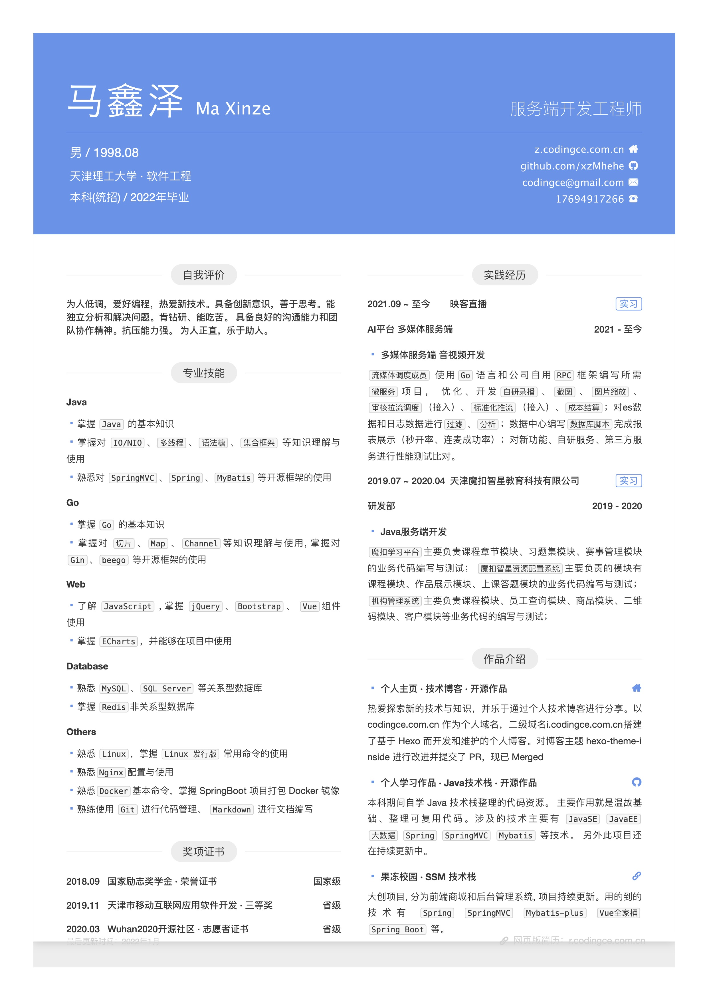

## 简历

https://r.codingce.com.cn

## PDF 版

[点我查看](./resume.pdf)

## 简历使用方式

前提: 已安装`nodejs` `npm`

- 0、`npm i` 安装依赖
- 1、**开发**：命令行运行 `npm run dev` 开启调试服务器
- 2、编辑 `/src/index.html` 文件实时调试
- 3、**生产**：命令行运行 `npm run build` 进行打包
- 4、浏览器打开 `/index.html` 进行预览

> chrome浏览器 - "打印" - 设置无边距 - 即可导出

## 简历参考借鉴来源

- [简历 | 闵聪 - Cong Min](http://resume.congm.in/)
<!-- > Fork 或借鉴请注明出处： [@Cong Min](https://congm.in) -->

<!--  -->

## 欢迎关注

更多精彩关注**后端码匠**公众号,更多资源等你来发掘       
期待与你一起进步😋                     

